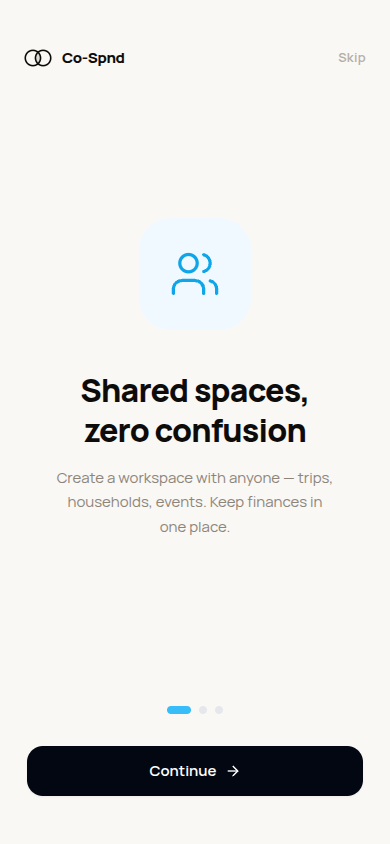
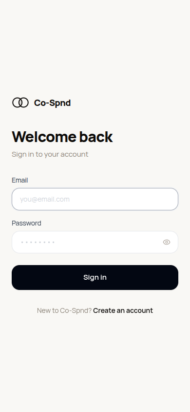
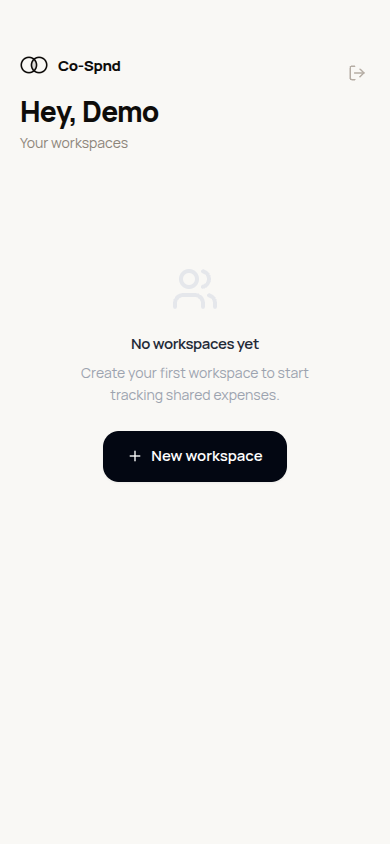
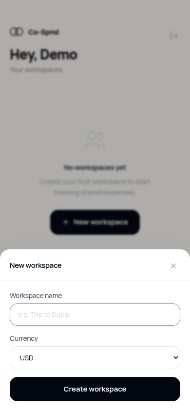
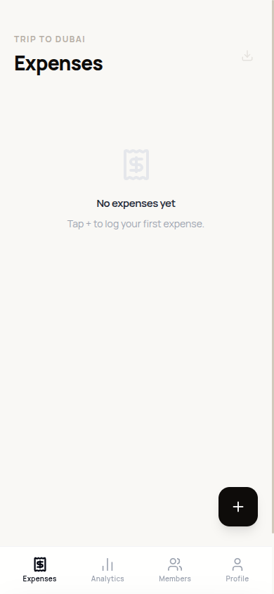
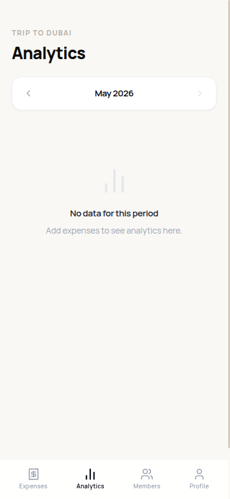
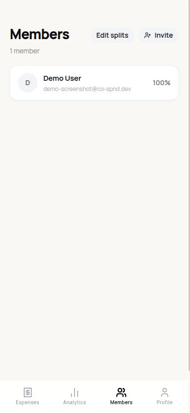

<div align="center">
  
  <h1><a href="https://co-spnd-web.vercel.app/">Co-Spnd</a></h1>
  <p>Minimalist shared expense tracking for groups</p>

  🌐 **[Live App](https://co-spnd.vercel.app/)**

  [](https://github.com/a7medayman6/co-spnd/stargazers)
  [](https://github.com/a7medayman6/co-spnd/network)
  [](https://github.com/a7medayman6/co-spnd/issues)
  [](https://github.com/a7medayman6/co-spnd/commits/main)

  If you find Co-Spnd useful, consider [⭐ starring the repo](https://github.com/a7medayman6/co-spnd) — it helps a lot.
</div>

---

## What Is Co-Spnd?

Co-Spnd is a minimalist shared finance app for tracking group expenses. Built for couples, roommates, and travel groups who want fast, low-friction expense logging with clear analytics — no bloat, no noise.

Create a workspace, invite your group, and start logging. See who spent what, where the money went, and how this month compares to last — all in a clean, mobile-first interface that stays out of your way.

---

## Screenshots

<table>
  <tr>
    <td align="center"><br/><sub>Onboarding</sub></td>
    <td align="center"><br/><sub>Login</sub></td>
    <td align="center"><br/><sub>Workspaces</sub></td>
    <td align="center"><br/><sub>Create Workspace</sub></td>
  </tr>
  <tr>
    <td align="center"><br/><sub>Transactions</sub></td>
    <td align="center"><br/><sub>Add Expense</sub></td>
    <td align="center"><br/><sub>Analytics</sub></td>
    <td align="center"><br/><sub>Members</sub></td>
  </tr>
</table>

---

## Product

### Core Flows

- Create or join a workspace with a shared currency
- Log transactions in seconds — amount and category are all you need
- **Paste a bank SMS or notification** to auto-fill amount, category, merchant, and date — no manual entry
- View the group's spending breakdown by category, by person, and over time
- Compare this month's spending to last month with a percentage delta
- Set a monthly budget per workspace and track progress with a colour-coded bar
- Browse expenses month-by-month with a simple prev/next navigator
- Invite members by email

### Design Philosophy

The app is intentionally small. Every screen has a single clear purpose:

- **Transactions** — the home base; log and browse expenses
- **Analytics** — understand where the money went
- **Workspaces** — manage groups and members
- **Profile** — account settings

The transaction entry experience is the highest-priority UX surface. Amount and category are front and center; description, date, and spender are tucked behind an optional section. Optimized for one-hand mobile use.

### Out of Scope

Intentionally excluded from the MVP:

- Savings goals
- Notifications or reminders
- Real-time sync or offline mode
- Multi-currency within a single workspace
- AI integrations
- Advanced permission roles

---

## Repository Structure

```
co-spnd/
├── co-spnd-api/     # NestJS + MongoDB REST API
├── co-spnd-web/     # React + Vite + Tailwind frontend
└── docs/
    ├── api-contract.md       # Authoritative API spec
    ├── system-prompt.md      # Frontend build prompt
    ├── logo.svg
    └── screenshots/
```

Both apps are deployed independently on Vercel. The monorepo root holds shared docs and configuration only — no shared packages or workspace tooling.

---

## Tech Stack

| Layer | Technology |
|---|---|
| Frontend | React 19, Vite 8, TailwindCSS 3 |
| Routing | React Router 7 |
| HTTP client | Axios |
| Charts | Recharts |
| Icons | Lucide React |
| Backend | NestJS 11 |
| Database | MongoDB via Mongoose 8 |
| Auth | JWT (passport-jwt) |
| Validation | class-validator + class-transformer |
| Deployment | Vercel (both apps) |

---

## Frontend — `co-spnd-web`

### Stack

- React 19 with functional components and hooks only
- Vite 8 for dev server and bundling
- TailwindCSS 3 for styling
- React Router 7 for client-side routing
- Axios for API calls
- Recharts for analytics charts

### Project Structure

```
co-spnd-web/src/
├── components/
│   ├── layout/          # AppLayout, BottomNav, ProtectedRoute
│   └── ui/              # Button, Card, Input, Modal, BottomSheet, Badge, ...
├── contexts/
│   └── AuthContext.tsx  # Global auth state + token management
├── hooks/
│   └── useAuth.ts
├── pages/
│   ├── auth/            # LoginPage, RegisterPage
│   ├── onboarding/      # OnboardingPage
│   ├── transactions/    # TransactionsPage, AddTransactionSheet
│   ├── analytics/       # AnalyticsPage, TrendChart, CategoryTrendChart, ...
│   ├── workspaces/      # WorkspacesPage, MembersPage
│   └── profile/         # ProfilePage
├── services/            # One file per API domain (auth, transactions, analytics, ...)
├── types/               # Shared TypeScript types
└── utils/
    ├── date.ts          # Formatting and month-range helpers
    ├── csv.ts           # CSV export
    ├── budget.ts        # Per-workspace monthly budget (localStorage)
    └── messageParser.ts # Bank message → transaction field extractor
```

### Environment Variables

```bash
cp co-spnd-web/.env.example co-spnd-web/.env
```

| Variable | Description |
|---|---|
| `VITE_API_URL` | Full base URL of the API including `/api/v1` |

```
VITE_API_URL=http://localhost:3000/api/v1
```

### Running Locally

```bash
cd co-spnd-web
npm install
npm run dev       # http://localhost:5173
```

### Building

```bash
npm run build     # outputs to co-spnd-web/dist/
npm run preview   # serve the built output locally
```

### Vercel Deployment

In the Vercel project settings:

- **Root Directory:** `co-spnd-web`
- **Build Command:** `npm run build`
- **Output Directory:** `dist`

The `vercel.json` inside `co-spnd-web/` handles SPA routing (all paths → `index.html`).

---

## Backend — `co-spnd-api`

### Stack

- NestJS 11 with Express adapter
- MongoDB via Mongoose 8
- JWT authentication via `@nestjs/passport` + `passport-jwt`
- `class-validator` for DTO validation
- Deployed as a Vercel serverless function via `src/vercel.ts`

### Module Structure

```
co-spnd-api/src/
├── auth/            # Register, login, JWT strategy
├── users/           # Profile read/update
├── workspaces/      # CRUD, invite, members, splitting config
├── transactions/    # CRUD scoped to workspace
├── analytics/       # Aggregations: totals, trends, top expenses, comparison, category trends
├── app.module.ts
├── main.ts          # Local dev entry
└── vercel.ts        # Serverless entry for Vercel
```

### Environment Variables

```bash
cp co-spnd-api/.env.example co-spnd-api/.env
```

| Variable | Description |
|---|---|
| `MONGODB_URI` | MongoDB connection string |
| `JWT_SECRET` | Secret used to sign JWT tokens |
| `PORT` | Port for local dev server (default: `3000`) |

```
MONGODB_URI=mongodb://localhost:27017/co-spnd
JWT_SECRET=supersecretkey
PORT=3000
```

### Running Locally

```bash
cd co-spnd-api
npm install
npm run start:dev    # watch mode — http://localhost:3000
```

### Building

```bash
npm run build        # compiles to co-spnd-api/dist/
npm run start:prod
```

### Testing

```bash
npm run test          # unit tests
npm run test:e2e      # end-to-end tests
npm run test:cov      # coverage report
```

### Vercel Deployment

In the Vercel project settings:

- **Root Directory:** `co-spnd-api`
- **Build Command:** `npm run build`

The `vercel.json` inside `co-spnd-api/` routes all requests to `src/vercel.ts`.

---

## API Reference

Base URL: `/api/v1`

All routes except `/auth/register` and `/auth/login` require a `Bearer` JWT token.

### Authentication

| Method | Path | Description |
|---|---|---|
| POST | `/auth/register` | Create account, returns JWT + user |
| POST | `/auth/login` | Login, returns JWT + user |

### Users

| Method | Path | Description |
|---|---|---|
| GET | `/users/me` | Get current user profile |
| PUT | `/users/me` | Update name and/or avatarUrl |

### Workspaces

| Method | Path | Description |
|---|---|---|
| GET | `/workspaces` | List workspaces for current user |
| POST | `/workspaces` | Create workspace (name + currency) |
| POST | `/workspaces/:id/invite` | Invite a user by email |
| GET | `/workspaces/:id/members` | List workspace members |
| GET | `/workspaces/:id/splitting-config` | Get per-member split percentages |
| PATCH | `/workspaces/:id/splitting-config` | Update split percentages (creator only, must sum to 100) |

### Transactions

| Method | Path | Description |
|---|---|---|
| GET | `/workspaces/:id/transactions` | List transactions (`?from=&to=`) |
| POST | `/workspaces/:id/transactions` | Create transaction |
| PUT | `/transactions/:id` | Update transaction (creator only) |
| DELETE | `/transactions/:id` | Delete transaction (creator only) |

Transaction fields: `amount` (required), `category` (required), `description`, `date`, `spenderId` (defaults to self).

### Analytics

| Method | Path | Description |
|---|---|---|
| GET | `/workspaces/:id/analytics` | Totals + by-category + by-user (`?from=&to=`) |
| GET | `/workspaces/:id/analytics/trends` | Spending over time (`?granularity=day\|month&from=&to=`) |
| GET | `/workspaces/:id/analytics/top-expenses` | Top N transactions (`?limit=10&from=&to=`) |
| GET | `/workspaces/:id/analytics/comparison` | Current month-to-date vs previous full month |
| GET | `/workspaces/:id/analytics/category-trends` | Top 3 categories by month (`?from=&to=`) |

Full request/response shapes: [`docs/api-contract.md`](docs/api-contract.md).

---

## Authorization Rules

- All workspace routes require the requester to be a workspace member
- Transaction updates and deletes are restricted to the transaction's creator
- Splitting config updates are restricted to the workspace creator
- Currency is immutable after workspace creation

---

## Local Development

```bash
# Terminal 1 — API
cd co-spnd-api && npm install && npm run start:dev

# Terminal 2 — Web
cd co-spnd-web && npm install && npm run dev
```

Make sure MongoDB is running locally before starting the API.
